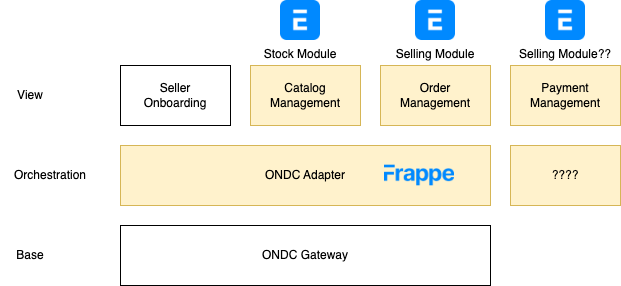

# ADR 0001: Initial Architecture

## Status
Proposed

## Context
The architecture needs to allow for quick development of an MVP for a SaaS platform for an ONDC MSN Seller Application that provides following features on top of the ONDC network:
- User authentication and authorization - supporting multiple sellers
- Product catalog management (define products, manage inventory)
- Order management (accept, update, track orders)
- Payment processing (accept payments, manage settlements)

## Decision
- Use Frappe and ERPNext as the base framework for building the ONDC MSN Seller Application.
- Implement the mapping between ERPNext and ONDC data models as a custom app within Frappe or an adapter layer that translates between the two systems.
- Deploy the application using helm charts on a Kubernetes cluster.

## Evaluation
- Frappe/ERPNext is developer friendly and provides a plugin architecture that allows for selective re-use of modules for catalog and order management.
- Modules have built in support for user management and provides RBAC implementation across objects
- Can be easily deployed on Kubernetes using helm charts

### Outcomes required for successful evaluation
- Local setup for development and deployment to kubernetes.
- Setup login for multiple sellers.
- Add modules necessary for catalog, order and payment management.
- Implement custom app to map ERPNext data models to ONDC data models (Do it just for product catalog as part of evaluation)

## Consequences
- The use of Frappe and ERPNext will speed up development due to their built-in features for user management, product catalog, and order management.
- It will lock us into the Frappe ecosystem, which may limit flexibility in the near term

## Alternatives Considered
- Building the application from scratch using different backend (e.g., Express, FastAPI) and a frontend frameworks (e.g., React, Vue.js), which would require more time and effort to implement basic features.

## References

## Diagram

